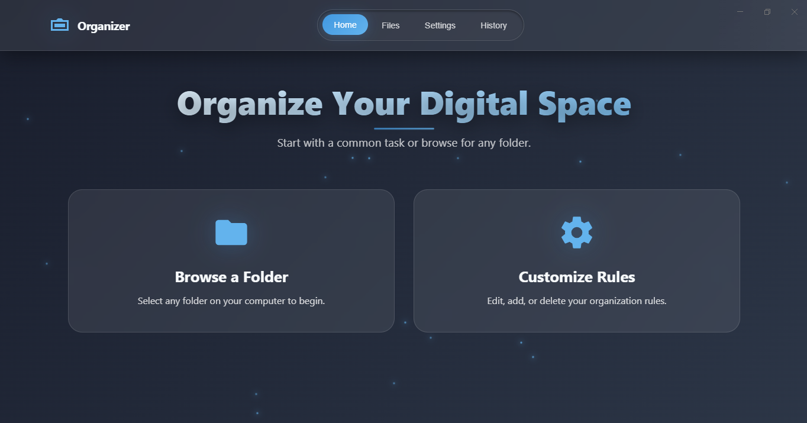

# PC Organizer ✨


A sleek, modern desktop application built with Electron to help you intelligently organize files on your computer based on customizable rules.

---




## 🌟 Key Features

This application combines a beautiful, animated user interface with powerful file management capabilities.

#### 🎨 Modern User Interface
- **Glassmorphism Design:** A beautiful semi-transparent "glass" effect on key UI components.
- **Animated Background:** A subtle, shifting gradient background that brings the app to life.
- **Light & Dark Themes:** Instantly switch between a light and dark mode to suit your preference.
- **Smooth Animations:** All interactions, from button hovers to modal popups, are fluid and responsive.

#### 📂 Core File Organization
- **Browse Any Folder:** Easily select any folder on your computer to view its contents.
- **Smart Organize:** With a single click, organize all files in the selected folder based on your defined rules.
- **File Tree View:** See a clear, hierarchical view of the files within the selected directory.

#### ⚙️ Customizable Rules Engine (Settings)
- **Add Custom Categories:** Create new categories for organization (e.g., "Fonts", "Work Documents", "RAW Photos").
- **Assign File Extensions:** Assign multiple file extensions (like `.ttf`, `.otf`) to each category.
- **Dynamic Rule Management:** All rules are saved and can be edited or deleted at any time.
- **Reset to Defaults:** Instantly restore the default organization rules.

#### 📜 Activity History & Undo
- **Complete Timeline:** View a detailed, timestamped history of every file organization action you've performed.
- **One-Click Undo:** Made a mistake? The history view allows you to undo any previous organization batch, safely moving all files back to their original locations.
- **Clear History:** Easily clear all past activity logs for a fresh start.


## 🛠️ Tech Stack

- **[Electron](https://www.electronjs.org/):** Core framework for building the cross-platform desktop application.
- **[Node.js](https://nodejs.org/):** Backend environment for file system operations (`fs` module).
- **[Electron Forge](https://www.electronforge.io/):** The toolchain used for packaging and building the final executable.
- **HTML5, CSS3, Vanilla JavaScript:** The building blocks of the user interface and application logic.

## 🚀 Getting Started (For Developers)

To get a local copy up and running for development purposes, follow these simple steps.

### Prerequisites
- **Node.js:** Make sure you have Node.js (v16 or later) installed. You can download it [here](https://nodejs.org/).
- **Git:** You will need Git to clone the repository.

### Installation & Running
1. **Clone the repository:**
   ```bash
   git clone https://github.com/your-username/pc-organizer.git
   cd pc-organizer
   ```
   [TODO]: Replace `your-username/pc-organizer.git` with your actual repository URL.

2. **Install NPM packages:**
   This will install all the necessary dependencies, including Electron.
   ```bash
   npm install
   ```

3. **Run the application in development mode:**
   This command will start the application with developer tools open.
   ```bash
   npm start
   ```

## 📦 Building the Application (.exe)

This project uses **Electron Forge** to handle the build process. The configuration is already set up in `package.json`.

### Steps to Build the Executable

1. **(One-Time Setup) Install Forge & Import Project:**
   If you are setting this up for the first time on a new machine, you need to install the Forge CLI and import the project.
   ```bash
   npm install --save-dev @electron-forge/cli
   npx electron-forge import
   ```

2. **Add an Application Icon:**
   - Create an icon file in `.ico` format (256x256 pixels is a good size).
   - Place it in your project, for example at `src/assets/icon.ico`.
   - Ensure the `package.json` forge configuration points to this icon for both `packagerConfig` and `maker-squirrel`.

3. **Run the Build Command:**
   This command will package the application and create an installer and a runnable folder for your current operating system (e.g., a `.exe` on Windows).
   ```bash
   npm run make
   ```

### Locating the Output

After the build process finishes, you will find all the output files in a new `out` directory.

- **The Installer (for distribution):**
  This is the file you would share with users. It provides a standard installation experience.
  - Path: `out/make/squirrel.windows/x64/YourAppName-1.0.0 Setup.exe`

- **The Raw Application (for testing):**
  This is the unpackaged application folder. You can run it directly without installation.
  - Path: `out/pc-organizer-win32-x64/pc-organizer.exe`

## 📄 License

Distributed under the MIT License. See `LICENSE` for more information.

Copyright (c) 2023 - elmehdi
```
